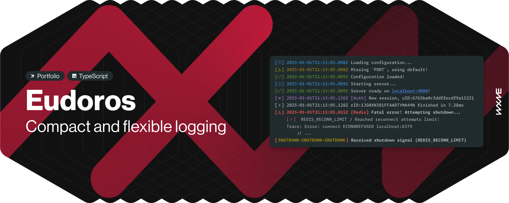

# 🛠️ Eudoros - Compact & Flexible Logging Utility

A powerful and customizable logging library for Node.js, with support for custom log levels, formatting, and file logging.

## Overview

Eudoros is a robust and flexible logging utility for Node.js applications. It allows you to define custom logging levels with configurable prefixes, formatting, and file logging capabilities. Designed to be highly extensible and easy to integrate into your project.

This utility comes with minimal defaults to ensure it works out of the box. When initializing without any configuration, it will create a single basic logging method. All logs are by default written to the `./logs` directory.

> **Fun fact for recruiters** _(\*wink wink\*)_**:** I made this in a under 24 hours (8h of sleep included) with almost non-existent previous TypeScript or module building knowledge. Began work 2 hours before [this commit](https://github.com/xwirkijowski/identity-service/commit/0e91c9fffa0513ed18597b3fe96c8d6949d24c5c) in the [identity-service](https://github.com/xwirkijowski/identity-service) repo. This is my first npm package, and I'm pretty proud of it :)

## Features

- Define custom log levels with configurable prefixes, handling options, formatting and processing (on log to file)
- Supports various console methods (all valid methods: `log`, `info`, `error`, `warn`, `debug`)
- Fully customizable `Date` object handling with a preferred static method or custom formatting function
- Supports custom formatting functions that allow to pass your logs to other observability services (like Axiom)
- Optional automatic formatting of payload arguments (numbers, arrays, objects)
- Optional console log grouping and exception trace insertion
- Option to output specific logs to separate files
- Asynchronous and synchronous logging modes
- Comprehensive error handling that won't crash your app!

## Installation

You can install Eudoros using npm `npm install eudoros`.

## Usage

You can manually choose whether to choose the ESM or CJS version.
- By default `import { Eudoros } from 'eudoros'` will import the CommonJS version.
- You can use the ECMAScript module version by specifying the export path `import { Eudoros } from 'eudoros/esm'`.

[ more soon ]

## Contributing

You are welcome to contributions to Eudoros! If you have any ideas, bug reports, or pull requests, feel free to submit them to the [GitHub repository](https://github.com/xwirkijowski/eudoros).

## License

Eudoros is licensed under the [Apache License 2.0](LICENSE).
